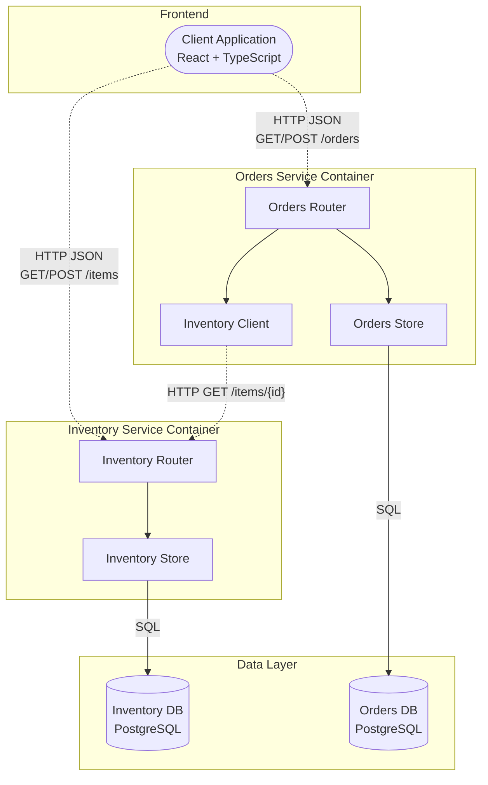
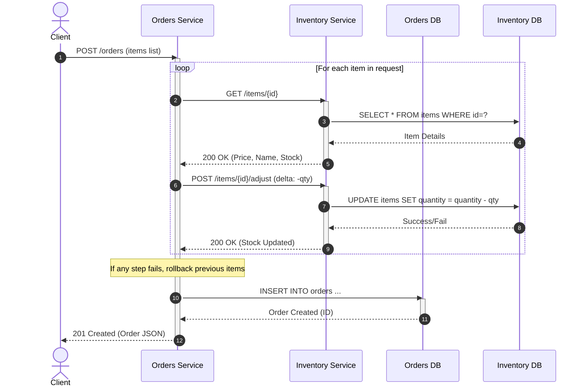
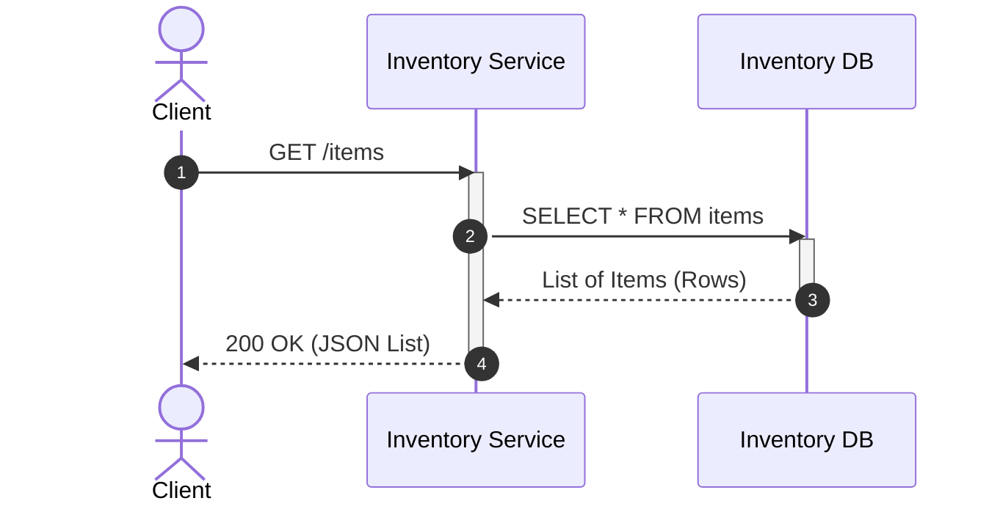

Проект: Система управления инвентарем и заказами (микросервисы на Go)

Структура:
- services/inventory - сервис управления товарами (порт 8001)
- services/orders - сервис управления заказами (порт 8002)
- cmd/client - простой CLI-клиент для тестирования
- docker-compose.yml - для запуска сервисов

Запуск локально:
1) Для каждого сервиса выполнить go run main.go в соответствующей папке.
   Пример:
     cd services/inventory && go run main.go
     cd services/orders && go run main.go
2) CLI-клиент:
     cd cmd/client && go run main.go list | create | order

Описание API см. в коде сервисов.

## Архитектура проекта

## Диаграмма последовательности (Создание заказа)

## Диаграмма последовательности (Получение списка товаров)

## Сравнение архитектурных подходов

| Критерий | Монолитная архитектура | Многоуровневая архитектура | **Микросервисная архитектура (✅ Выбор проекта)** |
| :--- | :--- | :--- | :--- |
| **Масштабируемость** | **Вертикальное.** Ориентирована на увеличение ресурсов сервера. Горизонтальное расширение затруднено. | **Гибкое.** Уровни приложения могут масштабироваться независимо от уровня хранения данных. | **Идеальная.** Позволяет точечно масштабировать только те сервисы, которые испытывают нагрузку, экономя ресурсы и повышая эффективность. |
| **Производительность** | **Высокая** (для малых систем). Нет сетевых задержек внутри процесса. | **Средняя.** Возможны небольшие задержки между слоями. | **Высокая под нагрузкой.** Возможность параллельной обработки запросов и использования специализированных быстрых языков (Go) для критических узлов компенсирует сетевые расходы. |
| **Простота разработки и сопровождения** | **Высокая** (на старте). Единая кодовая база. | **Удобная.** Чёткое разделение ответственности. | **Модульная.** Система разбита на небольшие, понятные части. Легче вносить изменения в один сервис, не затрагивая остальные. Упрощает параллельную разработку командами. |
